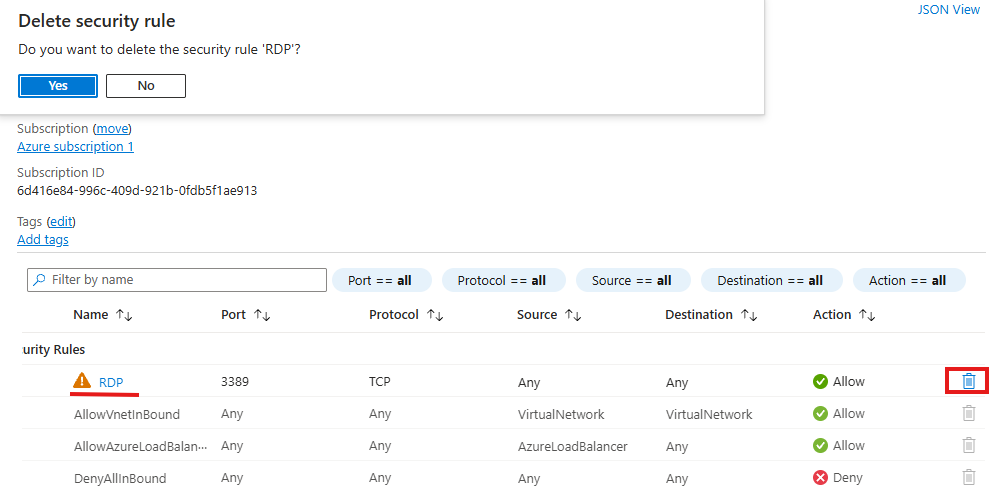

1. Create a resource group  

2. Create a virtual network

   

3. Create a virtual machine (Honeypot)
   
   

4. This is the resource groups after done of created look.

   

5. Go to network security group to open the firewall for the attack vector access . Delete the default RDP.

    
