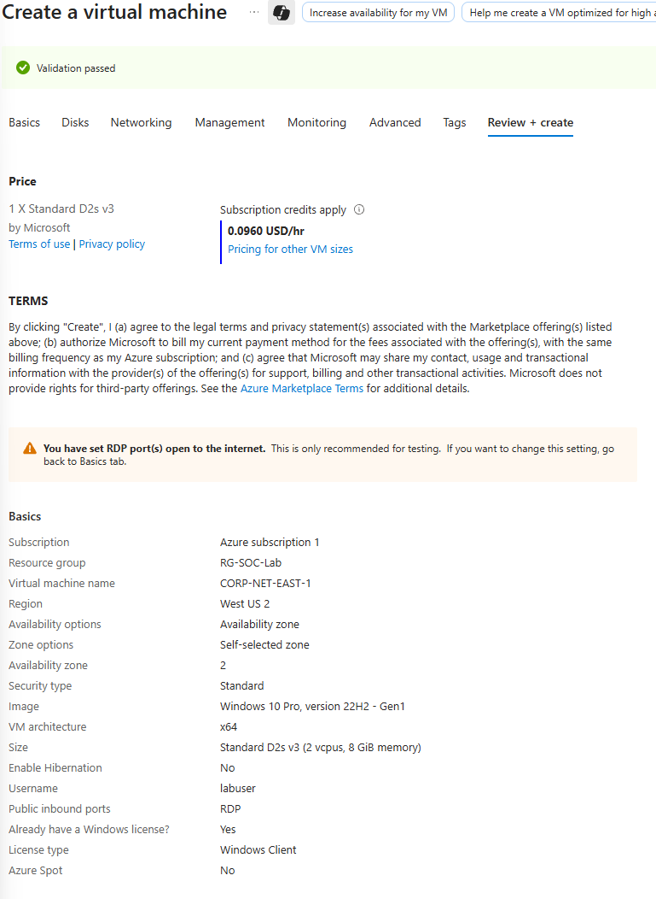
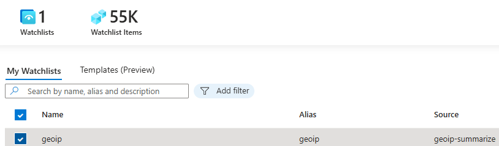
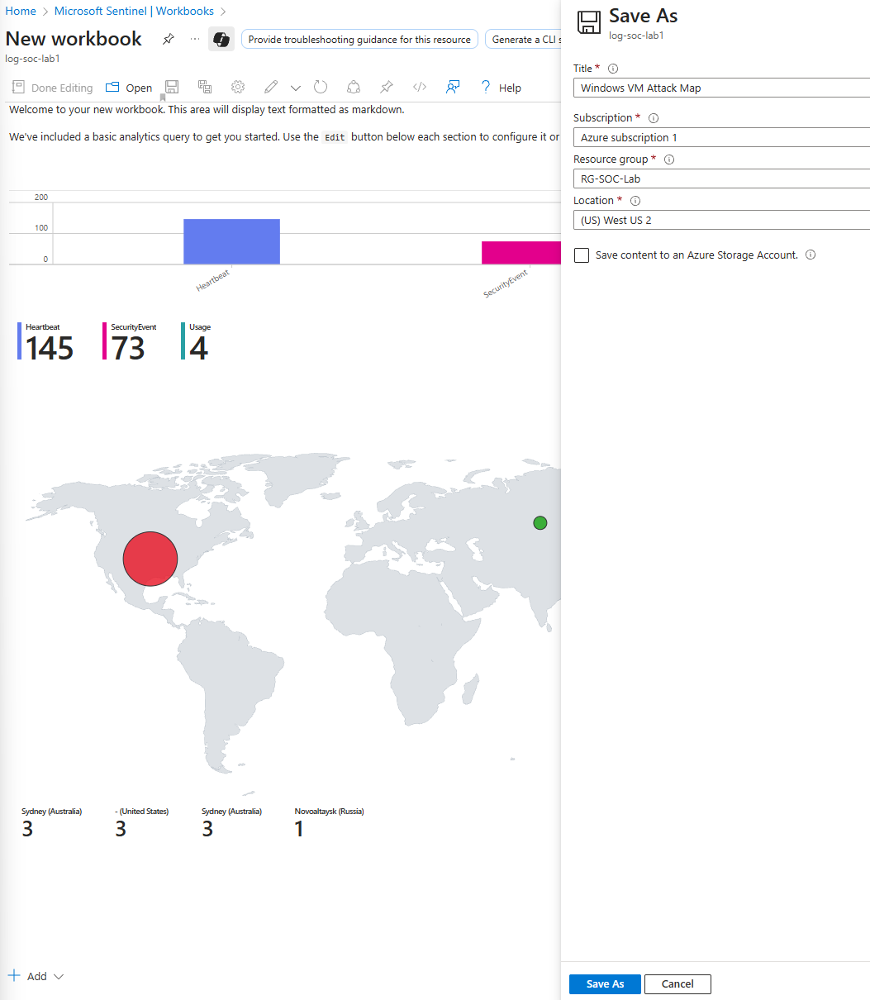

1. Create a resource group  

2. Create a virtual network

   

3. Create a virtual machine (Honeypot)
   
   

4. This is the resource groups after done of created look.

   

5. Go to network security group to open the firewall for the attack vector access . Delete the default RDP.

    

6. Add new inbound security rule.

    

7. Go the Azure virtual machines copy the Public IP address. Use your own computer Remote Desktop Connection paste the Public IP content. After that , enter the VM username and password to access the Azure VM.

    

8. Access successfully.

    

9. Run -" wf.msc ". Go to Windows Defender Firewall Properties. Turn off domain, private and public profile firewall state.

    

10. Go to your own cmd try to ping the VM Public IP. Check can access to the VM or not.

     

11. Go to Azure create Log Analytics workspace.

     

12. Go Azure Microsoft Sentinel add the LOG-SOC-LAB1 for link log analytics workspace to the Azure Microsoft Sentinel (SIEM).

    

13. Microsoft Sentinel | Content hub - search “ Windows Security Events” and intstall it.

    

14. After done install go to manage . Select - Windows Security Events via AMA - Open connector page

    

15. Create data collection rule. 

    

16. Go to Microsoft Sentinel - create a watchlist wizard and upload the geoip-summarised excel file for using the attacker IPaddress detect latitude,longitude,cityname and countryname.

   
   

17. After finished upload, you are able to see 1 watchlists and 55k watchlist items.

    

18. Go to Log Analytics workspaces | LOG-SOC-LAB1 | Logs - select KQL mode . Then write a KQL code for detect 4625 login failed event log statement.
let GeoIPDB_FULL = _GetWatchlist("geoip"); let WindowsEvents = SecurityEvent 
| where EventID == 4625 
| order by TimeGenerated desc 
| evaluate ipv4_lookup(GeoIPDB_FULL, IpAddress, network); WindowsEvents 
| project TimeGenerated, Computer, AttackerIp = IpAddress, cityname, countryname, latitude, longitude, Activity

   

19. Go to Microsoft Sentinel | Workbooks > Add Workbook > Edit > Add > Add query > select Advanced Editor > write the query to create a map.

{
	"type": 3,
	"content": {
	"version": "KqlItem/1.0",
	"query": "let GeoIPDB_FULL = _GetWatchlist(\"geoip\");\nlet WindowsEvents = SecurityEvent;\nWindowsEvents | where EventID == 4625\n| order by TimeGenerated desc\n| evaluate ipv4_lookup(GeoIPDB_FULL, IpAddress, network)\n| summarize FailureCount = count() by IpAddress, latitude, longitude, cityname, countryname\n| project FailureCount, AttackerIp = IpAddress, latitude, longitude, city = cityname, country = countryname,\nfriendly_location = strcat(cityname, \" (\", countryname, \")\");",
	"size": 3,
	"timeContext": {
		"durationMs": 2592000000
	},
	"queryType": 0,
	"resourceType": "microsoft.operationalinsights/workspaces",
	"visualization": "map",
	"mapSettings": {
		"locInfo": "LatLong",
		"locInfoColumn": "countryname",
		"latitude": "latitude",
		"longitude": "longitude",
		"sizeSettings": "FailureCount",
		"sizeAggregation": "Sum",
		"opacity": 0.8,
		"labelSettings": "friendly_location",
		"legendMetric": "FailureCount",
		"legendAggregation": "Sum",
		"itemColorSettings": {
		"nodeColorField": "FailureCount",
		"colorAggregation": "Sum",
		"type": "heatmap",
		"heatmapPalette": "greenRed"
		}
	}
	},
	"name": "query - 0"
}

   

20. After Done editing you able to see a map locator Attacker from where. Then configure the title, resource group and save as.

     
     
21. This is a report after one day, with a total 6.58k attack to the VM.

              
